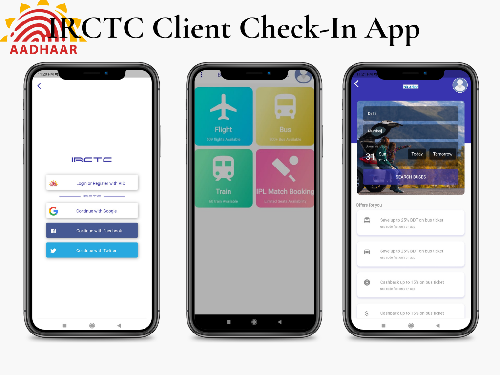

[![Contributors][contributors-shield]][contributors-url]
[![Forks][forks-shield]][forks-url]
[![Stargazers][stars-shield]][stars-url]
[![Issues][issues-shield]][issues-url]


<br />
<p align="center">
  <a href="https://github.com/TheSpeedX/UIDAI-Hackathon">
    
  </a>

  <h3 align="center">UVerifier</h3>

  <p align="center">
    Aadhaar Authenticator Application 
    <br />
    <a href="https://github.com/TheSpeedX/UIDAI-Hackathon/"><strong>Explore the docs »</strong></a>
    <br />
    <br />
    <a href="https://github.com/TheSpeedX/UIDAI-Hackathon/">View Demo</a>
    ·
    <a href="https://github.com/TheSpeedX/UIDAI-Hackathon/issues">Report Bug</a>
    ·
    <a href="https://github.com/TheSpeedX/UIDAI-Hackathon/issues">Request Feature</a>
  </p>
</p>


<!-- TABLE OF CONTENTS -->
<details open="open">
  <summary>Table of Contents</summary>
  <ol>
    <li>
      <a href="#about-the-project">About The Project</a>
      <ul>
        <li><a href="#built-with">Built With</a></li>
      </ul>
    </li>
    <li>
      <a href="#getting-started">Getting Started</a>
      <ul>
        <li><a href="#installation">Installation</a></li>
      </ul>
    </li>
    <li><a href="#screenshots">ScreenShots</a></li>
    <li><a href="#contributing">Contributing</a></li>
    <li><a href="#license">License</a></li>
    <li><a href="#contact">Contact</a></li>
  </ol>
</details>


<!-- ABOUT THE PROJECT -->
## About The Project
This is the UVerifier System for smoothing Check-In/Booking experience for end clients. The system consists of two applications first the AadharVerifier and The POC IRCTC Client App. 


There are many great README templates available on GitHub, however, I didn't find one that really suit my needs so I created this enhanced one. I want to create a README template so amazing that it'll be the last one you ever need -- I think this is it.

Here's why:
* Your time should be focused on creating something amazing. A project that solves a problem and helps others
* You shouldn't be doing the same tasks over and over like creating a README from scratch
* You should implement DRY principles to the rest of your life :smile:

Of course, no one template will serve all projects since your needs may be different. So I'll be adding more in the near future. You may also suggest changes by forking this repo and creating a pull request or opening an issue. Thanks to all the people have have contributed to expanding this template!

A list of commonly used resources that I find helpful are listed in the acknowledgements.

### Built With

This section should list any major frameworks that you built your project using. Leave any add-ons/plugins for the acknowledgements section. Here are a few examples.
* [Bootstrap](https://getbootstrap.com)
* [JQuery](https://jquery.com)
* [Laravel](https://laravel.com)


<!-- GETTING STARTED -->
## Getting Started


This is an example of how you may give instructions on setting up your project locally.
To get a local copy up and running follow these simple example steps.

### Installation

- Clone the repo using 
```sh
git clone https://github.com/TheSpeedX/UIDAI-Hackathon.git
```

- Web
  - Aadhar Authenticator
  ```sh
  pip install -r requirements.txt
  uvicorn main:app 
  ```
  - POC IRCTC APP API
  ```sh
  npm install
  npm start
  ```
- Android
  - UVerifier
  - POC IRCTC APP
  - Verifier Admin


<!-- USAGE EXAMPLES -->
## Screenshots


  


<!-- CONTRIBUTING -->
## Contributing

Contributions are what make the open source community such an amazing place to be learn, inspire, and create. Any contributions you make are **greatly appreciated**.

1. Fork the Project
2. Create your Feature Branch (`git checkout -b feature/AmazingFeature`)
3. Commit your Changes (`git commit -m 'Add some AmazingFeature'`)
4. Push to the Branch (`git push origin feature/AmazingFeature`)
5. Open a Pull Request


<!-- LICENSE -->
## License

Distributed under the MIT License. See `LICENSE` for more information.


<!-- CONTACT -->
## Contact

Your Name - Team X-Legion Coders(UIDAI Hackathon 2021)

Project Link: [https://github.com/TheSpeedX/UIDAI-Hackathon](https://github.com/TheSpeedX/UIDAI-Hackathon)


<!-- MARKDOWN LINKS & IMAGES -->
<!-- https://www.markdownguide.org/basic-syntax/#reference-style-links -->
[contributors-shield]: https://img.shields.io/github/contributors/othneildrew/Best-README-Template.svg?style=for-the-badge
[contributors-url]: https://github.com/TheSpeedX/UIDAI-Hackathon/graphs/contributors
[forks-shield]: https://img.shields.io/github/forks/othneildrew/Best-README-Template.svg?style=for-the-badge
[forks-url]: https://github.com/TheSpeedX/UIDAI-Hackathon/network/members
[stars-shield]: https://img.shields.io/github/stars/othneildrew/Best-README-Template.svg?style=for-the-badge
[stars-url]: https://github.com/TheSpeedX/UIDAI-Hackathon/stargazers
[issues-shield]: https://img.shields.io/github/issues/othneildrew/Best-README-Template.svg?style=for-the-badge
[issues-url]: https://github.com/TheSpeedX/UIDAI-Hackathon/issues
[license-shield]: https://img.shields.io/github/license/othneildrew/Best-README-Template.svg?style=for-the-badge
[license-url]: https://github.com/TheSpeedX/UIDAI-Hackathon//blob/master/LICENSE.txt
[linkedin-shield]: https://img.shields.io/badge/-LinkedIn-black.svg?style=for-the-badge&logo=linkedin&colorB=555
[linkedin-url]: https://linkedin.com/in/othneildrew
[product-screenshot]: images/screenshot.png
